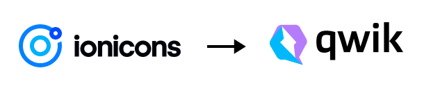
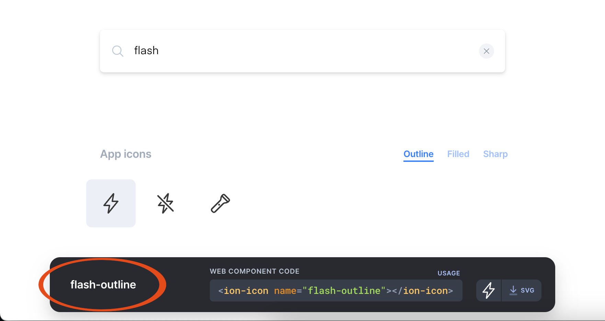

<p align="center">
  
</p>
<hr>

<p align="center">
  <a href="https://www.npmjs.com/package/@tectonique/ionicons-qwik">
    
  </a>
  
</p>

# ⚡️ Ionicons for Qwik

1. Are you using the [Qwik framework 🔗](https://qwik.builder.io/)?
2. Do you want to use [Ionicons 🔗](https://ionic.io/ionicons)?
3. Would you like to have **full control over** the icon **SVGs** in JSX?

_**Then this library is perfect for you!**_

# 📖 Table of contents

<!-- TOC -->
* [⚡️ Ionicons for Qwik](#-ionicons-for-qwik)
* [📖 Table of contents](#-table-of-contents)
* [⚒️ Installation](#-installation)
* [🐣 Icon search](#-icon-search)
* [🍽️ Usage](#-usage)
* [⚙️ Props](#-props)
* [🌈 Colours](#-colours)
* [🏎️ Size and performance](#-size-and-performance)
* [❤️ Kudos](#-kudos)
* [🩹 Problems?](#-problems)
* [🦔 Author](#-author)
<!-- TOC -->

# ⚒️ Installation
NPM:
```bash
npm add @tectonique/ionicons-qwik
```

Yarn:
```bash
yarn add @tectonique/ionicons-qwik
```

# 🐣 Icon search
You need an icon? Go to:

[➡️ Ionicons + Search 🔎](https://ionic.io/ionicons)

Pick an icon and remember its name.

An example (remember the marked name):


# 🍽️ Usage
You found an icon and have its name? Perfect! 🎉

Rewrite the name using **Pascal Case**. So `flash-outline` becomes `FlashOutline`.

Now you can import `FlashOutline` straight from the library:
```ts
import { FlashOutline } from "@tectonique/ionicons-qwik";
```

Here is an example component:
```tsx
import { FlashOutline } from "@tectonique/ionicons-qwik";

export default component$(() => {
    return <FlashOutline width="64" data-test="flash-icon" />
})
```

# ⚙️ Props
The following
attributes are typed:
- `id: string`
- `class: string`
- `width: string`
- `height: string`
- `style: { /* CSS style object */ }`

All other props are passed as well! You could, for example, pass test IDs like so:

```tsx
export default component$(() => {
    return <FlashOutline width="64" data-test="flash-icon" />
})
```

# 🌈 Colours
All SVGs make use of the `currentColor` property. This means, you can
flexibly colorize all icons by specifying the font color.

For that, you can use:
- CSS classes
- inline style
- Tailwind classes
- ... whatever you like :)

# 🏎️ SVG/HTML footprint
The library is constructed using Qwik's `component$` method.

**Every single icon variant is one component.**

This means:
- You make use of Qwik's usual JS optimization feature.
- Only the icons you use are ever imported/loaded.
- The server pre-renders initially visible icons.

# ❤️ Kudos

1. Big Kudos to the Ionic-Team for creating the awesome Ionicons collection! ❤️
2. Thanks dear Qwik-Team for making it so simple to create a Qwik component library! ❤️

# 🩹 Problems?

Feel free to create a GitHub issue. Thanks for reporting any problems! ☺️

# 🦔 Author
<p align="center">
  <b>Peter Kuhmann</b>
  <br>
  <a href="https://github.com/hedgehogs-mind">GitHub: hedgehogs-mind</a>
  <br>
  <br>
  <br>
  <b>Tectonique</b>
  <br>
  <br>
  
</p>